# ZAFUapp 每日一报 :rocket:

>**:exclamation: 声明：该脚本仅供学习使用，由此产生的一切问题均自行负责，与制作者无关**

脚本参考于&nbsp;&nbsp;[Debuffxb/ZAFU_DDUP](https://github.com/Debuffxb/ZAFU_DDUP)

## 使用说明

建议使用前先从ZAFUapp中进行一次登记，方便获取最新数据

1. 创建 GitHub 账户（必要 :smile: ）
2. [本仓库](https://github.com/Qyir/zafuapp-yqdj)
3. fork 一份到自己的仓库，进入自己的仓库（头像下拉菜单中的 Your repositories）

    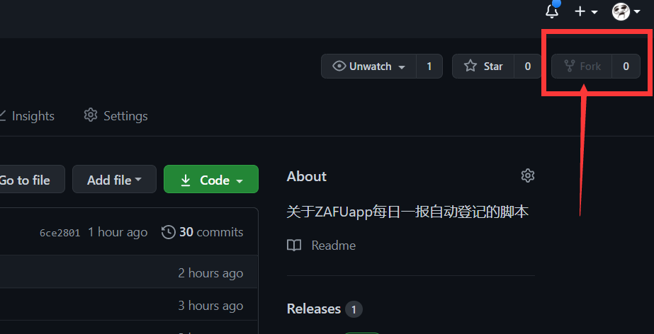

4. 到设置 `Settings` 中的 `Secrets` 添加自己的信息

    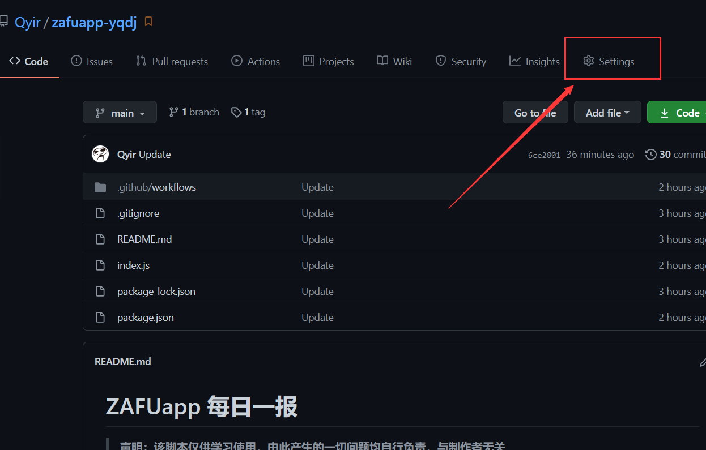

    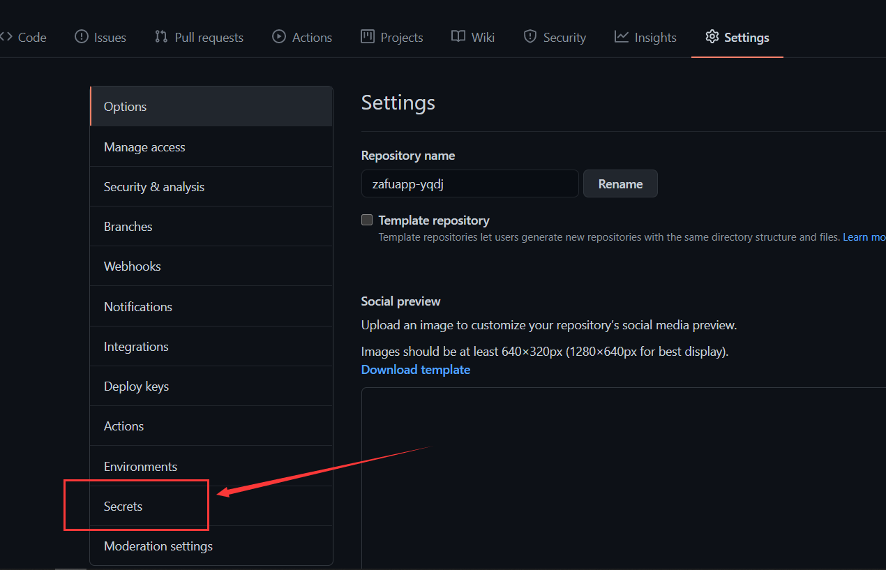

    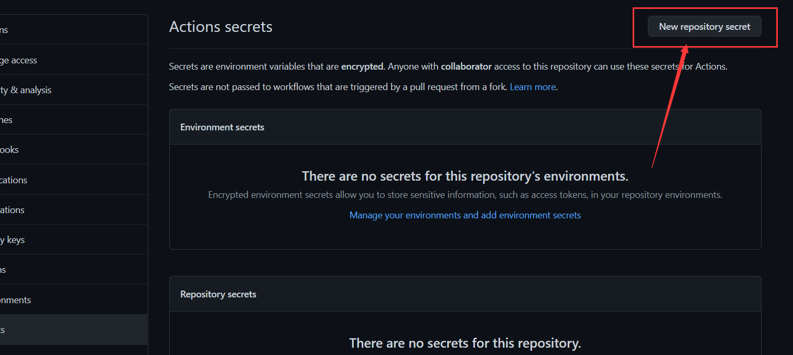

### 填写内容说明

```
    示例：
        键名: 值

    USERNAME: 学号
    PASSWORD: 密码
    LNG_LAT: 经度:纬度
        如：118.999999999:27.33234242343（注意：经度与纬度之间用英文的冒号 : 隔开）
    AREANAME: 区域
        如：XX省XX市XX区（县）  （注意：应与经纬度相匹配）
    ADDRESS: 详细地址
```

> 经纬度获取: [百度地图](https://api.map.baidu.com/lbsapi/getpoint/index.html)

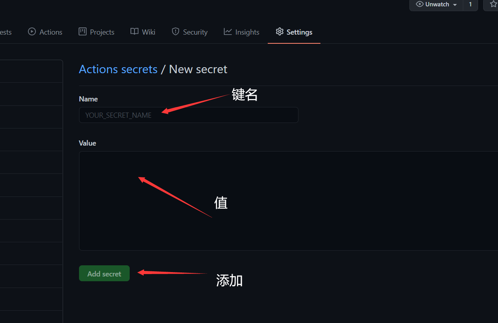

总共需要 5 个 `secrets key`

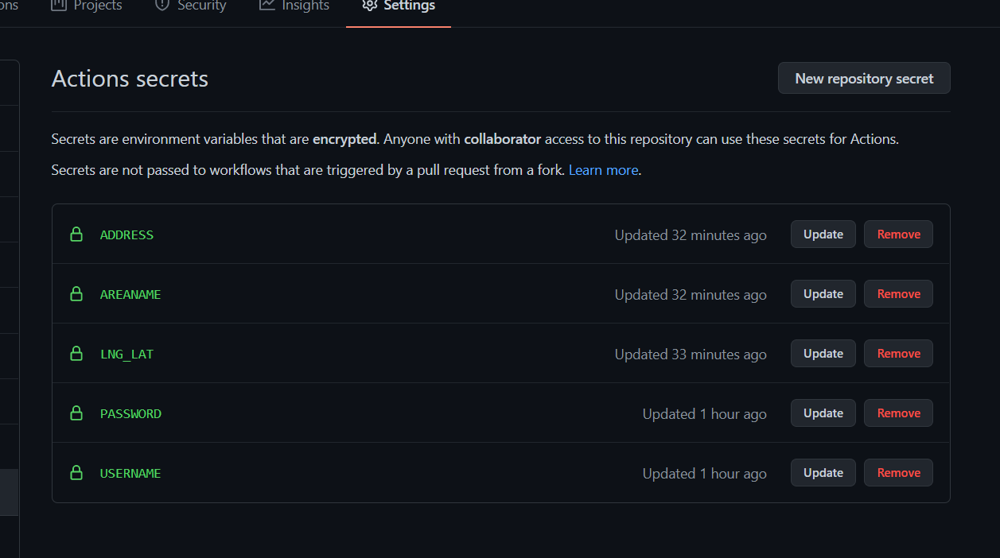

更新信息，如位置等，可以到相应的键名位置点击 `Update` 重新填写

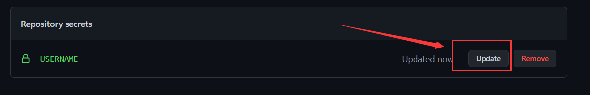

>体温度数默认 36.5，可以在 `index.js` 文件第 15 行的 `twds` 处自行修改

### 查看结果

1. 前往 `Actions` 部分

    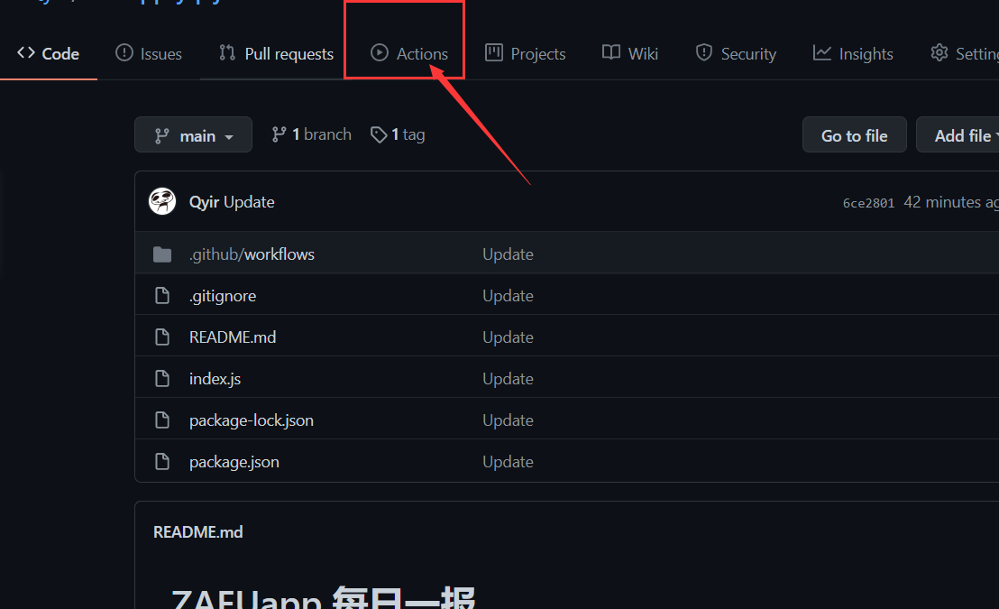

2. 点击相应的执行日志，上方为最新日志

    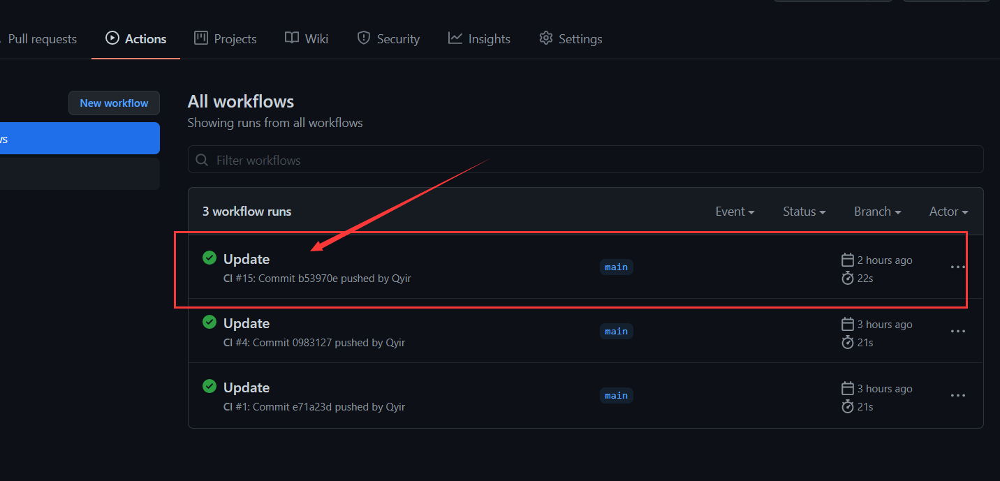

3. 点击工作任务 `build`

    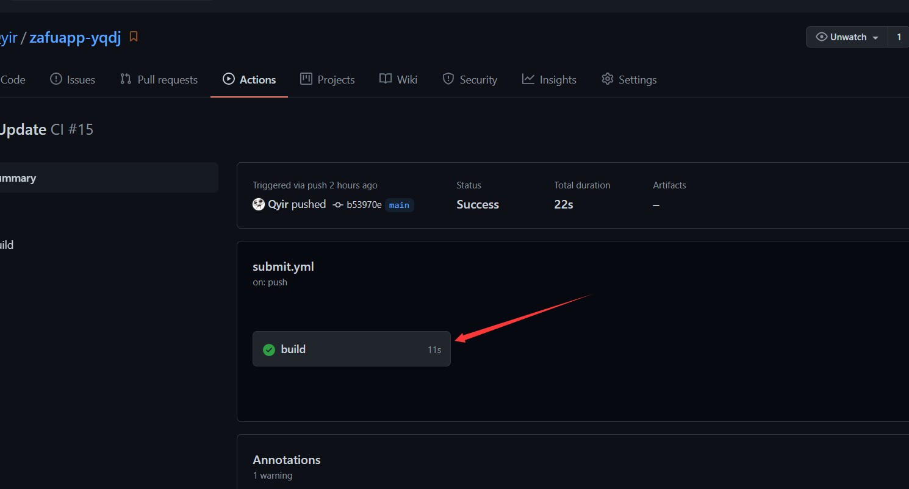

4. 在 `Run Script` 中即可以看到执行结果:sunglasses:

    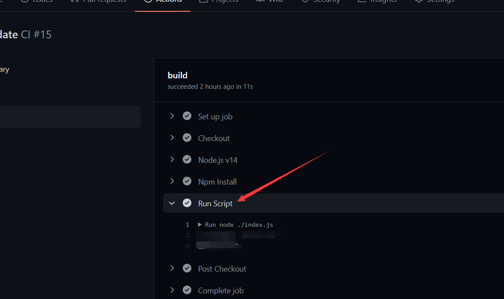

## LICENSE

[MIT](https://opensource.org/licenses/MIT)